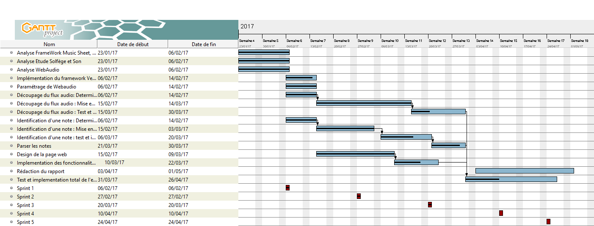

# KaraokeInverse

Pour cloner le projet : 
```
git clone https://github.com/PhilyT/KaraokeInverse.git  
```

  
  
### Documents  
  
Le travail de recherche se trouve dans le repertoire doc à  la racine.  
  
### Release  
  
>###### Version 1.0  
>Prévue pour la fin d'année :
>* Rendu du projet  

---

>###### Version 0.2  
>Prévue pour la semaine du 27/02/2017
>* Lecture de son par webaudio
>* Mise à jour de partition à partir d'un son simple, composé d'une seule harmonic, enregistré sur fichier audio type wav.
>* Determination d'un algorithme pour découper le flux audio en harmonics. 
>* Determination d'un algorithme pour identifier une note de music.

---

>###### Version 0.1  
>Réalisée le 07/02/17
>* Identification des tâches
>* Répartition des tâches
>* Réalisation d'un diagramme de gantt
>* Analyse des techonologies utilisées
  
### Contributeurs  
| Tâches | Contributeurs |  
|:---:|:---:|
| Analyse WebAudio | Aichatou Traore **&** Marouane Lamine |
| Analyse Son & Solfège | Tom Phily **&** Nourdine Bouchti |
| Analyse Framwork Score HTML5 | Estelle Rostan |
| Paramétrage de WebAudio | Aichatou Traore |
| Découpage du flux audio | Marouane Lamine **&** Nourdine Bouchti |
| Identification d'une Note | Tom Phily **&** Aichatou Traore |
| Implémentation du framwork VexFlow | Estelle Rostan |
| Design de la page | Estelle Rostan |  

    
  
### Dirigé par :  
Fabrice Huet  

## Sujet  
  
Dans le karaoké, le texte défile sur l'écran et une personne essaie de le chanter plus ou moins justement. Le but de ce projet est de faire exactement l'inverse, c'est à dire partir d'un son et l'afficher sur l'écran. En partant d'une note jouée ou chantée, le logiciel devra analyser sa fréquence et afficher la note correspondante sur une partition à l'écran. Le fonctionnement est donc globalement celui d'un accordeur.  Pour que le projet soit très XXIème siècle, tout sera fait en WebAudio/HTML/JS.
  
Site Web : https://github.com/PhilyT/KaraokeInverse