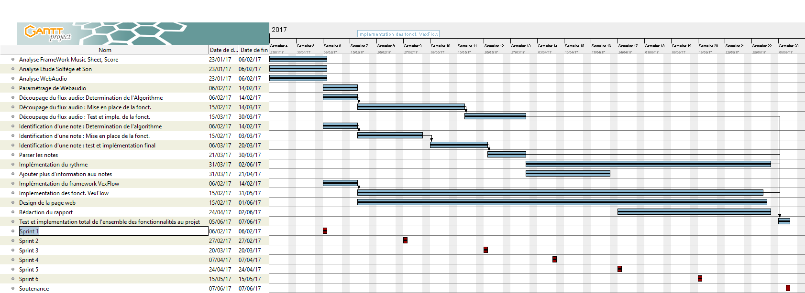

# KaraokeInverse

Pour cloner le projet : 
```
git clone https://github.com/PhilyT/KaraokeInverse.git  
```  
  
### Documents  
  
Le travail de recherche se trouve dans le repertoire doc à  la racine.

## Utilisation du metrenome
* + or → pour augmenter Tempo
* - or ← pour diminuer Tempo

### Contributeurs  
| Tâches | Contributeurs |  
|:---:|:---:|
| Analyse WebAudio | Aichatou Traore **&** Marouane Lamine |
| Analyse Son & Solfège | Tom Phily **&** Nordine Bouchti |
| Analyse Framwork Score HTML5 | Estelle Rostan |
| Paramétrage de WebAudio | Aichatou Traore **&** Marouane Lamine **&** Nordine Bouchti |
| Découpage du flux audio | Marouane Lamine **&** Nordine Bouchti |
| Identification d'une Note | Tom Phily **&** Aichatou Traore |
| Implémentation du framwork VexFlow | Estelle Rostan |
| Design de la page | Estelle Rostan **&** Aichatou Traore |

    
  
### Dirigé par :  
Fabrice Huet  

## Sujet  
  
Dans le karaoké, le texte défile sur l'écran et une personne essaie de le chanter plus ou moins justement. Le but de ce projet est de faire exactement l'inverse, c'est à dire partir d'un son et l'afficher sur l'écran. En partant d'une note jouée ou chantée, le logiciel devra analyser sa fréquence et afficher la note correspondante sur une partition à l'écran. Le fonctionnement est donc globalement celui d'un accordeur.  Pour que le projet soit très XXIème siècle, tout sera fait en WebAudio/HTML/JS.
  
## Fonctionnalités de base

* Lire le flux audio du micro de l’utilisateur ou à partir d’un fichier audio (implémentation de webaudio -> Aichatou, Marouane & Nordine)
* Reconnaître une note de musique à partir du flux audio lu :
* * récupéré la fréquence toute les milliseconde à partir d’un algorithme -> Marouane et Nordine
* * Identifier la note par rapport à la fréquence obtenue -> Aichatou et Tom
* Afficher les notes sur la partition :
* * Détecter les notes selon le rythme joué -> Tom
* * Implémenter VexFlow, afficher une partion -> Estelle
* Liste des éléments à afficher sur la partition : 
* * notes de musique pleine -> Estelle
* Créer une nouvelle partition arrivé à la fin de la dernière -> Tom
* Rafraichir les partitions -> Nordine
* Documenter le code  -> Marouane et Estelle


## Les fonctionnalités ajoutées

* Permettre à l'utilisateur de choisir le rythme joué afin de facilité la détection des notes. -> Tom

## Technologies employées

* WebAudio : https://developer.mozilla.org/fr/docs/Web/API/Web_Audio_API
* * API qui permet la capture de son, de la visualization, du traitement audio sur le web.
* PitchDetect : https://github.com/cwilso/PitchDetect/blob/master/js/pitchdetect.js
* * PitchDetect est un algorithme qui permet de récuperer la retrouver la fréquence fondamental dans buffer audio en fonction de la valeur de son amplitude. Licence MIT
* GetSong-Metronome : https://github.com/tabs4acoustic/GetSong-Metronome/
* * GetSong-Metronome permet d'afficher un metronome. Licence MIT
* VexFlow : https://github.com/0xfe/vexflow
* * VexFlow permet d'afficher des partions et des notes de musiques. Licence MIT
  
### Release  
  
>###### Version 1.0  
>Réalisée le  02/06/2017
>* Rendu du projet  

---

>###### Version 0.6  
>Réalisée le  19/05/2017
>* Nouvelle interface graphique
>* Correction de bug

---

>###### Version 0.5  
>Réalisée le 02/05/2017
>* Ajout d'information sur les notes
>* Recherche sur le rythme
>* Redistribution des tâches au sein de l'équipe

---

>###### Version 0.4  
>Réalisée le 21/04/2017
>* Affichage des notes sur partition.
>* Recherche sur comment implémenter le rythme et les intervalles.
>* Test de l'application web dans le but de trouver d'éventuel beug.

---

>###### Version 0.3  
>Réalisée le 29/03/2017
>* Implémentation des algorithme de détection de fréquence et de détection de note dans l'ihm.
>* Identification des fréquences par le micro et par fichier audio.
>* Retour des notes sous le standard abc américain.


---

>###### Version 0.2.1  
>Réalisée le 27/02/2017
>* Correction du design de la page index.html suite à un mauvais merge et mise à jour des version dans le readme

---

>###### Version 0.2  
>Réalisée le 27/02/2017
>* Lecture de son par webaudio
>* Mise à jour de partition à partir d'un son simple, composé d'une seule harmonic, enregistré sur fichier audio type wav.
>* Determination d'un algorithme pour découper le flux audio en harmonics. 
>* Determination d'un algorithme pour identifier une note de music.

---

>###### Version 0.1  
>Réalisée le 07/02/17
>* Identification des tâches
>* Répartition des tâches
>* Réalisation d'un diagramme de gantt
>* Analyse des techonologies utilisées
