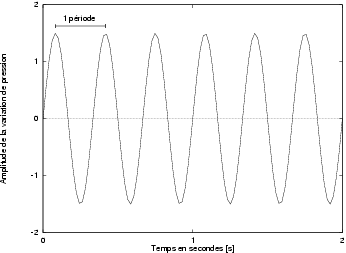

# Son et Solfège

### Qu'est-ce qu'un son ?
Sensation auditive engendrée par une vibration acoustique.  
Un son est caractérisé par son intensité (exprimée en décibel dB), par sa hauteur (liée à sa fréquence exprimée en Hertz Hz) et par son timbre, qui dépend du nombre, de la hauteur et de l'intensité de ses harmonics.  
Un son a pour autre caractéristique sa durée (exprimée en seconde s).

## Le Solfège

## La note

### Hauteur d’une note
Une note musicale est composée de plusieurs fréquences. La fréquence la plus basse, appelée fréquence fondamentale, est celle qui permet de définir la hauteur du son. Plus la fréquence fondamentale est basse, plus le son perçu est grave. Plus elle est haute, plus le son perçu est aigu.

### Durée d’une note
La durée d’une note correspond au temps pendant lequel la note est tenue et perçue. Par exemple, pour marquer la fin d’une œuvre, la plupart des morceaux s’achèvent sur une note tenue.

## Les harmoniques
En acoustique, un partiel harmonique est une composante d’un son périodique (et plus généralement d'une onde), dont la fréquence est un multiple entier d'une fréquence fondamentale1.  
En prenant comme note fondamentale le « la3 » (440 Hz) du piano, les harmoniques sont toutes les notes ayant pour fréquence un multiple de 440.

Le son est une notion tellement complexe qu'il faut plusieurs paramètres pour le décrire. Le phénomène physique du son peut être étudié de manière quantitative et les propriétés de l'onde acoustique peuvent être exprimées sous la forme de grandeurs objectives. Nous allons en analyser quatre: hauteur tonale, intensité, timbre et durée. Ces quatre paramètres suffisent à décrire globalement un son.

## Ton ou hauteur tonale
La notion de ton est intimement liée à celle de fréquence.
### Définition : 
Le nombre d'oscillations d'un son dans un temps donné est sa fréquence. C'est la hauteur tonale ou ton du son perçu.
Le temps au bout duquel une fréquence se répète est une période. Une onde est dite périodique quand elle est composée de telles répétitions. La valeur de la fréquence est évaluée en fonction du nombre de ses périodes dans un temps donné.

Une fréquence de 1000 [Hz] est donc une fréquence dont le cycle se reproduit 1000 fois par seconde. La figure illustre ces notions.

La période est ainsi inversement proportionnelle à la fréquence (c'est-à-dire égale à 1/f): si la fréquence est de 3 [Hz], la période est de 1/3 seconde.

En principe, il n'y a pas de limitation dans la gamme des fréquences des sons possibles.
La limitation de la perception est importante pour tous les traitements liés au son; on part du principe qu'il est inutile d'enregistrer ou de stocker un son imperceptible. Nous reviendrons plus loin sur cette limitation et analyserons l'impact sur la phase de numérisation.

Les fréquences ont permis de définir les notes. Ainsi le do moyen qui se trouve au milieu du clavier d'un piano a une fréquence de 264 [Hz]. Un diapason produit le son la (pur) à 440 [Hz].

## Intensité
L'amplitude des variations de pression donne la seconde composante du son: l'intensité avec laquelle notre oreille percevra une note. L'intensité correspond au volume d'énergie d'une onde. L'amplitude du son est la mesure du changement de pression par rapport à une valeur moyenne. Cette mesure est l'intensité acoustique I qui est la puissance transportée par unité de surface du front d'onde et s'exprime, par exemple, en [W/cm2]. De telles grandeurs sont certes fort utiles, mais lorsqu'il s'agit de déterminer les conditions de bonne transmission de signaux sonores, il apparaît nécessaire de tenir compte des propriétés perceptives très particulières de l'ouïe. On fait alors appel à des grandeurs subjectives qui expriment ce que ressent l'être humain.

## Timbre
Un ensemble de fréquences et leurs variations d'intensité permettent d'avoir une sorte de carte d'identité du son, une forme d'onde générale, le timbre ou spectre. Il montre la proportion dans laquelle la fréquence fondamentale du son est mélangée à d'autres fréquences multiples de la fréquence fondamentale et appelées sons harmoniques. Un son qui n'est accompagné d'aucune harmonique est appelé son pur. Le timbre permet donc d'identifier la source sonore car chaque instrument produit un spectre de fréquences qui lui est propre.

## Durée
Enfin, la répétition d'une onde sonore donne à son tour la durée du son. Elle s'exprime en secondes et correspond au temps pendant lequel l'énergie du son est perceptible. Sur le diagramme 2.3, la durée du son est de 2 secondes.

Avec ces quatre paramètres, on dispose d'une description suffisante pour, par exemple, générer des sons. Produire de la musique de synthèse implique que l'on passe de la simple notation des sons à leur transcription dans la tonalité d'un instrument. Il faut pour cela prendre en compte le timbre, toutes les harmoniques qui accompagnent la production d'un son pur.

Le problème principal consiste à trouver la fréquence d'un son. on a pour cela utilisé un objet AudioAnalyser qui doit analyser le son qu'on récupère du microphone.

L' interface AnalyserNode représente un noeud capable de fournir en temps réel des informations d'analyse de la fréquence et du domaine temporel. C'est un AudioNode qui transmet le flux audio inchangé depuis l'entrée vers la sortie, mais permet de capturer les données générées pour les traiter et/ou les visualiser.

Il a exactement une entrée et une sortie. Le noeud fonctionne même si la sortie n'est pas connectée.

| Nombre d'entrées | 1 |  
|:---:|:---:|
| Nombre de sorties | 1 (mais peut être laissée non connectée). |
| Mode de comptage des canaux | "explicit" |
| Nombre de canaux | 1 |
| Interprétation du canal | "speakers" |

## Tableau des notes et de leurs frequences basé sur LA3 440 Hz
| Notes | (Hz) Oct.-1|  (Hz) Oct.0| (Hz) Oct.1| (Hz) Oct.2| (Hz) Oct.3| (Hz) Oct.4| (Hz) Oct.5| (Hz) Oct.6| (Hz) Oct.7| (Hz) Oct.8| (Hz) Oct.9|
|:---:|:---:|:---:|:---:|:---:|:---:|:---:|:---:|:---:|:---:|:---:|:---:|
|Do| 16.3 |	32.7 | 	65 |	131 | 	262 | 	523 | 	1046.5 | 	2093 | 	4186 |	8372 | 	16744 |
|Do#| 17.3 | 	34.6 | 	69 | 	139| 	277 | 	554 | 	1109 | 	2217 | 	4435| 	8870 | 	17740|
|RE| 18.3 |36.7 | 	74| 	147 | 	294 | 	587 | 	1175 | 	2349 | 	4698 | 	9396 | 	18792|
|Re#| 19.4 | 	38.9 | 	78 | 	156 | 	311 | 	622 | 	1244.5 |	2489 | 	4978 |	9 956 | 	19912|
|Mi| 20.5 | 	41.2 | 	83 |	165 |	330 | 	659 | 	1318.5 | 	2637 | 	5274 | 	10548 | 	21098|
|Fa| 21.8 |43.6 | 	87 |	175 | 	349 | 	698.5 | 	1397 |	2794 | 	5588 | 	11176 |  |
|Fa#| 23.1 |46.2 | 	92.5 |	185 | 370 | 	740 | 	1480 | 	2960 |	5920 | 	11840 |  |
|Sol| 24.5 |  	49.0 | 	98 | 	196 | 	392 | 	784 | 	1568 | 	3136 | 	6272 | 	12544 |  |
|Sol#| 26.0 |51.9 | 	104 | 	208 | 	415 | 	831 | 	1661 | 	3322 | 	6645 | 	13290  |
|La| 27.5 | 55.0 | 	110 | 	220 | 	440 | 	880 | 	1760 | 	3520 | 	7040 | 	14080 |  |
|La#| 29.1 | 58.0 | 	117 | 	233 | 	466 | 	932 | 	1865 | 	3729 | 	7458 | 	14918 |  |
|Si| 30.8 | 62.0 | 	123 | 	247 | 	494 | 	988 | 	1975 | 	3951 | 	7902 | 	15804 |  |

## Identification de la note en fonction de la frequence
La formule ci dessous à pour but de trouver l'intervalle auquelle la fréquence appartient si elle représente une note.
Cette intervalle dépend d'un variable = 0.1 choisie par défaut afin de filtrer au mieu les fréquences les plus éloignées d'une note.
Le but est de faire corresondre la note en fonction de la gamme tempérée représenté dans le tableau ci-dessus.
FreqBase = fréquence de la note à l'octave -1
Si la fréquence est compris dans l'intervalle :
[(freqBase-0.1)*2^(octave+1); (freqBase+0.1*2^(octave+1)]
alors la fréquence correspond à la note présente dans cette intervalle.

## Detection de la note en fonction du rythme
Une note est jouée selon un rythme, pour simplifier notre algorithme, l'utilisateur choisie le rythme des notes et nous avons restreint l'affichage des notes jouer dans le rythme.
Comme l'utilisateur ne peu pas jouer à la millième de seconde une note dans le rythme, on affiche la note qui a la plus forte amplitude dans l'internvalle de temps I suivant :
Soit tempo la durée entre chaque note,
I = [ tempo - tempo/4 ; tempo + tempo/4 ]
Ainsi nous avons un intervalle de temps qui est proportionnelle au tempo choisie.

## Recherche des algorithmes
Elaboration de l'algorithmes de recherche de notes sur la base du projet PitchDetect avec MIT licence.

### Sources
* http://culturesciencesphysique.ens-lyon.fr/ressource/Formaterre2012-spectre-signal-Vidal.xml
* http://www.telecom.ulg.ac.be/teaching/notes/total0/elen036/node15_ct.html
* https://developer.mozilla.org/fr/docs/Web/API/AnalyserNode
* http://www.cochlea.org/entendre
* https://fr.wikipedia.org/wiki/Harmonique_(musique)
* http://jeanjacques.dialo.free.fr/frequenc.htm
* Dictionnaire Hachette edition 2004
* https://github.com/cwilso/PitchDetect