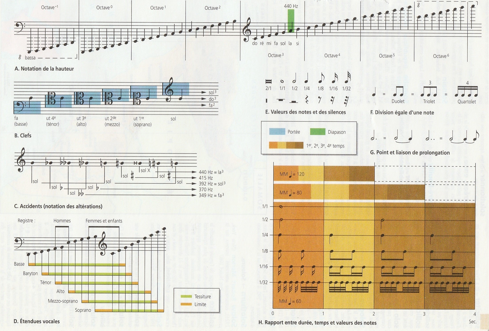

# Son et Solfège

### Qu'est-ce qu'un son ?
Sensation auditive engendrée par une vibration acoustique.  
Un son est caractérisé par son intensité (exprimée en décibel dB), par sa hauteur (liée à sa fréquence exprimée en Hertz Hz) et par son timbre, qui dépend du nombre, de la hauteur et de l'intensité de ses harmonics.  
Un son a pour autre caractéristique sa durée (exprimée en seconde s).

## Le Solfège

## La note

### Hauteur d’une note
Une note musicale est composée de plusieurs fréquences. La fréquence la plus basse, appelée fréquence fondamentale, est celle qui permet de définir la hauteur du son. Plus la fréquence fondamentale est basse, plus le son perçu est grave. Plus elle est haute, plus le son perçu est aigu.

### Durée d’une note
La durée d’une note correspond au temps pendant lequel la note est tenue et perçue. Par exemple, pour marquer la fin d’une œuvre, la plupart des morceaux s’achèvent sur une note tenue.

## Les harmoniques
En acoustique, un partiel harmonique est une composante d’un son périodique (et plus généralement d'une onde), dont la fréquence est un multiple entier d'une fréquence fondamentale1.  
En prenant comme note fondamentale le « la3 » (440 Hz) du piano, les harmoniques sont toutes les notes ayant pour fréquence un multiple de 440.

### Sources
* http://www.cochlea.org/entendre
* https://fr.wikipedia.org/wiki/Harmonique_(musique)
* Dictionnaire Hachette edition 2004